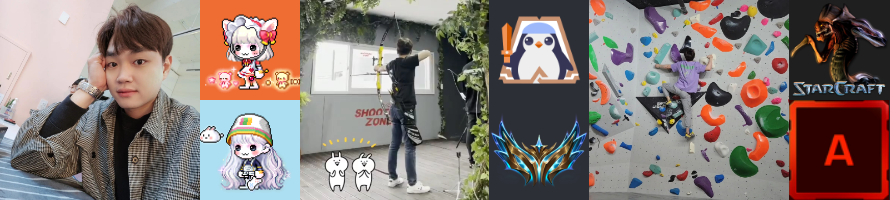
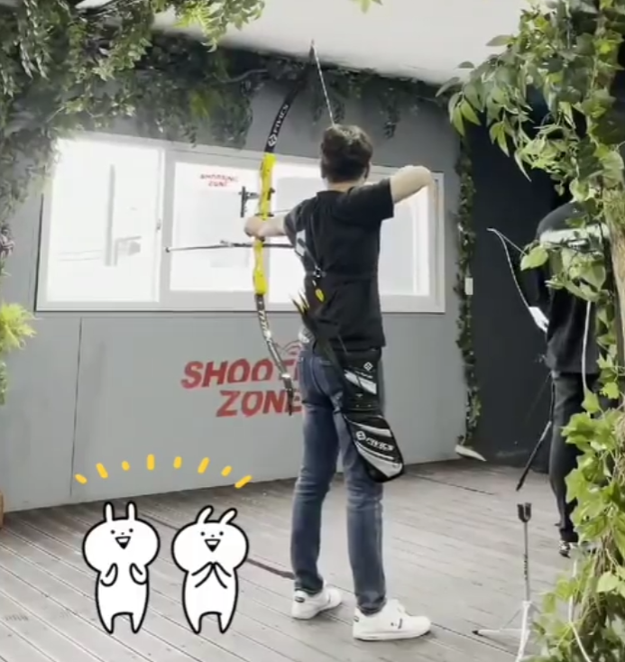
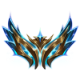
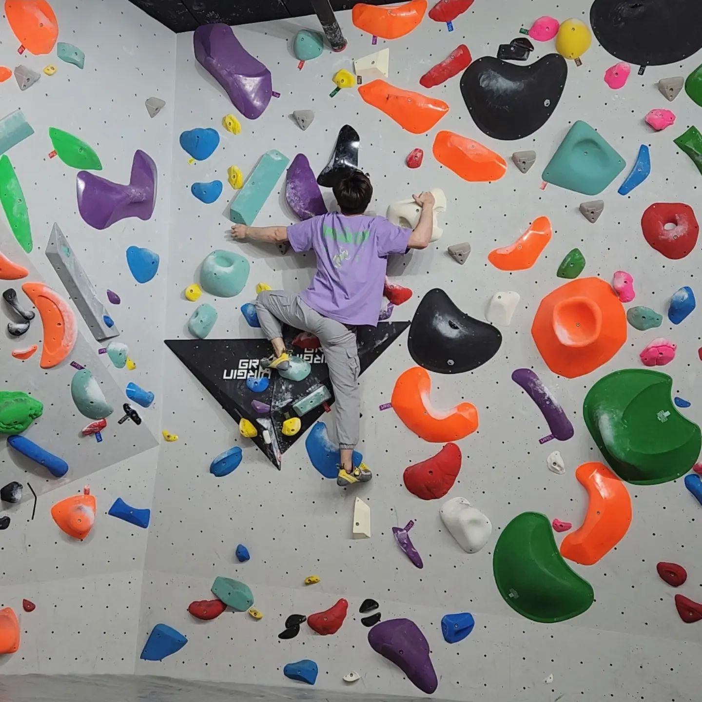
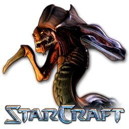

## History📝  

🌳 [네이버 부스트캠프 9 멤버십](https://boostcamp.connect.or.kr/) 2024.08 ~ **Now**  
💡 [Solved 문제해결 스터디](https://solved.ac/profile/xofo95/solved) 2024. 02 ~ **Now**  
🎓 [한양사이버대학교(컴퓨터공학과)](https://www.hycu.ac.kr/user/index.do) 2021.03 ~ *2025. 01  

## 

🌳 [네이버 부스트캠프 9 베이직 & 챌린지](https://boostcamp.connect.or.kr/) 2024.06 ~ 2024.08  
🧱 [마인크래프트 무슨서버](https://www.youtube.com/playlist?list=PLVontrELGlZ5WqskkuPyMrUKtwkpsrjnd) 2024. 03 ~ 2024. 05  
🚗 [프로젝트 NsCar](https://github.com/TaeRaeKim/TaeRaeKim/raw/main/docs/Project%20NSC.docx) 2024. 01 ~ 2024. 02  
🍄 [메이플스토리 월드 슈퍼 해커톤 (수상)](https://enter.nexon.com/msw/mci22/program#showcase) 2022. 08 ~ 2022. 11  
🏢 [삼성전자(네트워크/개발팀)](https://www.samsung.com/sec/) 2014. 02 ~ 2021. 04  
🎓 [한국애니메이션고(컴퓨터게임제작과)](https://anigo-h.goegh.kr/anigo-h/main.do) 2011.03 ~ 2014. 02  

## Tech Stack👩🏻‍🌾  

<!-- https://github.com/tandpfun/skill-icons?tab=readme-ov-file#icons-list -->

## Hobby🤸‍♂️  

<!-- 

    
    

        
        
    

    
    

        
        
    

    
    

        
        
    

 -->

